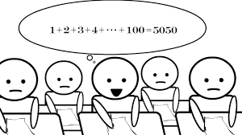

This simple calculator was designed to be able to calculate equations and functions and output a number with variable amount of digits. This includes addition, subtraction, multiplication, division, and exponentiation. I assisted in working on the addition and multiplication operations while providing assistance towards other portions of the code when needed. Upon use we had to simply input the numbers and operation used to calculate a solution between these two numbers, afterwards the amount of digits that can be displayed is provided as a changeable option for the user.
