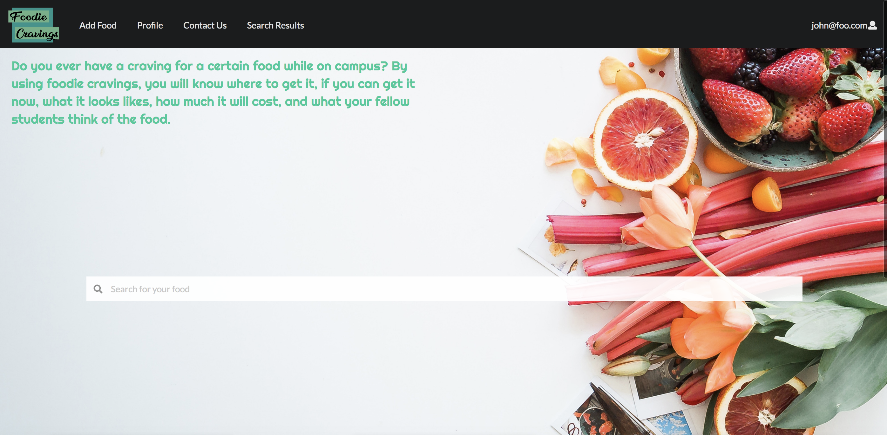

## What is Foodie Cravings?
For example, if the user were to look up the term 'Chicken' using the search function of the website, they would be able to see a dropdown list containing different food options pertaining to the word 'Chicken'. Choosing any of those options would allow that food to be listed within the Search Results page. The user can also create their own profiles to be able to 'Add Food' options to the website to be able to review and keep a list of them if they were considering of going back for seconds to that restaurant, or if they needed other options. Generally speaking, the user can create their profile, search for specific foods, add foods to their own profile along with favoriting them, and provide reviews and ratings as how they see fit as long as it is appropriate.

## My Role in the Team
For the development of this website, I was able to contribute to adding the 'Add Food/Edit Food' functionalities where the user will be able to add and edit food items; for example they would be able to add 'Mochicko Chicken' to their profile and edit the price if it were to change from $8 to 9$. I was also able to contribute to adding a 'Comment' section per card, allowing users to not only add their foods and rate it, but to comment it as well for specific details regarding that food. I've also assisted other group members with their parts when needed and assisted in adding more defaultFood data to be shown as examples and cleanup by removing unnecessary files and fixing eslint errors. 

## Learning Experience
With this project comes with great learning experiences. I have come to learn more about web development along with its applications and benefits. It was a struggling yet fun experience to go through; with this I've also come to realize how amazing these new tools and coding languages can be that I may possibly do more personal projects when time allows it. There were definitely issues and problems alonog the way, but they were resolved in the end; this basically added more to the learning experience in a positive manner.

You can learn more about the Github organization [here](https://foodiecravings.github.io/).
You can also learn take a look at our website, Foodie Cravings, [here](http://foodiecravings.meteorapp.com/#/).

